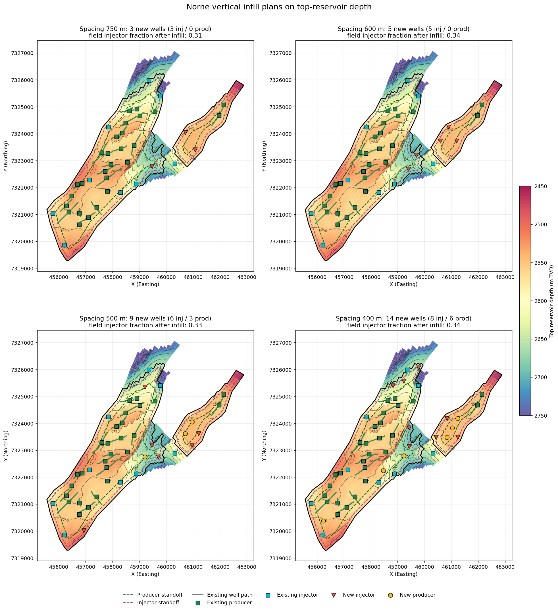

# Vertical Infill Planner

Python tool that places **vertical infill wells** inside a field boundary and assigns
each one as an **injector or producer**.

- **Spacing:** new wells keep a minimum spacing from each other and from existing wells.
  Existing deviated or horizontal wells count along their whole trajectory.
- **Standoffs:** producers and injectors each keep their own distance from the boundary,
  for example the oil-water contact.
- **Reservoir-quality screening (optional):** producers only go where the map shows
  enough oil (net pay, So, ...).
- **Injector ratio:** applies to the new wells alone or to the whole field.


*Example application on the public Norne field model (see `examples/norne`).*

## Install
```bash
git clone <repository-url>
cd vertical-infill-planner
pip install -e .
```

## Quick start (command line)
```bash
infill-planner --boundary boundary.xlsx --wells wells.xlsx --spacing 750 \
    --injector-ratio 1:2 --out plan.xlsx --plot plan.png
```
(`python -m infill_planner ...` works too.)

### Input files
All inputs are CSV or Excel files. Column names are auto-detected (e.g. `X`, `Easting` or `Surface X`).

| Input | Content |
|---|---|
| `--boundary` | Field outline: one vertex per row (X, Y), optional `Zone` column for several blocks. GeoJSON/WKT also accepted |
| `--wells` | Existing wells: name, X, Y, optional type (`Producer`, `Water Injector`, `OP`, `WI`, ...) |
| `--well-paths` | Optional trajectories of deviated/horizontal existing wells: well name, X, Y, optional order/MD, one row per point |
| `--quality-map` | Optional reservoir-quality map: X, Y and one value (net oil pay, So, ...) |

Use projected coordinates (UTM, metres or feet), not latitude/longitude.

### Main options
| Option | Meaning |
|---|---|
| `--spacing 750` | Minimum distance between any two wells |
| `--layout hex/square/poisson` | Regular triangular grid (densest), square grid, or irregular layout |
| `--rotation 30` / `auto` | Grid azimuth, or search for the best fit |
| `--injector-ratio 1:2` | Injector:producer target (also `0.33` or `33%`) |
| `--ratio-scope new/field` | Ratio over new wells only, or over existing + new wells |
| `--role-method dispersed/pattern/scored` | How roles are chosen (see below) |
| `--producer-standoff 300` / `--injector-standoff 100` | Min distance from the boundary per role |
| `--min-producer-quality 10` | Min quality-map value for a producer |
| `--pay-weight 0.5` | Scored method: weight of low quality vs. spread when choosing injectors |
| `--max-new 20` | Keep the N locations closest to existing development |

## How it works
1. **Placement.** Candidate locations are laid on a hexagonal or square grid. The grid offset
   (and optionally its rotation) is searched to fit the most wells. Remaining gaps are filled.
   Every candidate is at least one spacing from all wells and trajectories.
2. **Eligibility.** A location may be a producer only if it is inside the producer standoff
   and meets the quality cutoff. It may be an injector only if it is inside the injector
   standoff and allowed by the quality map (e.g. not in a gas cap).
3. **Roles.**
   - `dispersed`: ratio plus an even spread of injectors.
   - `pattern`: classic floods (5-spot, 7-spot, inverted 9-spot, line drive).
   - `scored`: the ratio sets the injector count, and injectors go where a mix of spread and
     low quality scores highest, keeping the best rock for producers.
4. **QC and output.** Summary metrics (spacing achieved, field injector fraction, producer
   support by injectors, neighbour distances), CSV/XLSX export, and map plots.

## Python API
```python
from infill_planner import InfillPlanner, InfillConfig, load_polygons, load_wells

planner = InfillPlanner(load_polygons("boundary.csv"), load_wells("wells.csv"))
result = planner.run(InfillConfig(well_spacing=750, injector_ratio="1:2"))
result.print_summary()
result.to_file("plan.xlsx")
result.plot("plan.png")
```

## Working from a simulation model
`infill_planner.eclipse_io` reads Eclipse-format decks. It covers corner-point grids,
ACTNUM/EQLNUM/SWATINIT properties, EQUIL contacts and SCHEDULE wells (COMPDAT
trajectories, producer/injector roles). From these it builds the hydrocarbon outline,
net-oil-pay and depth maps, and existing trajectories.

`examples/norne/run_norne.py` shows the full workflow on the public Norne model:
```bash
python examples/norne/run_norne.py
```
The Norne data is downloaded automatically on first run.

## Scope and limitations
- New wells are **vertical**; locations are chosen in map view.
- This is a **screening** tool. Rank the candidates with a reservoir simulator before
  committing to drilling.
- It does not account for faults or compartments. Use current (not initial) saturation where
  available.
